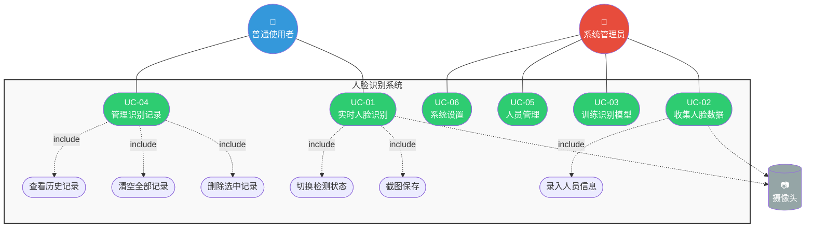

```mermaid
graph TB
    User(("👤<br/>普通使用者"))
    Admin(("👤<br/>系统管理员"))
    Cam[("📷<br/>摄像头")]
    
    subgraph System["人脸识别系统"]
        UC01(["UC-01<br/>实时人脸识别"])
        UC02(["UC-02<br/>收集人脸数据"])
        UC03(["UC-03<br/>训练识别模型"])
        UC04(["UC-04<br/>管理识别记录"])
        UC05(["UC-05<br/>人员管理"])
        UC06(["UC-06<br/>系统设置"])
        
        UC011(["截图保存"])
        UC012(["切换检测状态"])
        UC021(["录入人员信息"])
        UC041(["删除选中记录"])
        UC042(["清空全部记录"])
        UC043(["查看历史记录"])
    end
    
    User --- UC01
    User --- UC04
    
    Admin --- UC02
    Admin --- UC03
    Admin --- UC05
    Admin --- UC06
    
    UC01 -.-> Cam
    UC02 -.-> Cam
    
    UC01 -.->|include| UC011
    UC01 -.->|include| UC012
    UC02 -.->|include| UC021
    UC04 -.->|include| UC041
    UC04 -.->|include| UC042
    UC04 -.->|include| UC043
    
    style System fill:#f9f9f9,stroke:#333,stroke-width:2px
    style User fill:#3498db,color:#fff
    style Admin fill:#e74c3c,color:#fff
    style Cam fill:#95a5a6,color:#fff
    style UC01 fill:#2ecc71,color:#fff
    style UC02 fill:#2ecc71,color:#fff
    style UC03 fill:#2ecc71,color:#fff
    style UC04 fill:#2ecc71,color:#fff
    style UC05 fill:#2ecc71,color:#fff
    style UC06 fill:#2ecc71,color:#fff
```
